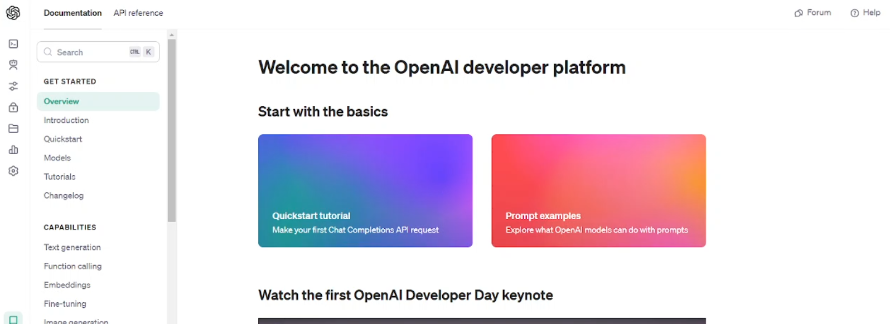

# UNIXBot
A bot script to use ChatGPT on any UNIX based system without visiting ChatGPT official website.

# Made by Atul

## Installation Instructions

### Clone the repo
```bash
git clone https://github.com/Atuls-git/UNIXBot.git
```
### Move to cloned folder
```bash
cd UNIXBot
```
### Get permissions
```bash
chmod +x *
```
### Install dependencies
```bash
./setup.sh
```
### Run the main file
```bash
python3 main.py
```
## Obtain your API_KEY by following instructions in this video

[](src/video.mp4?autoplay=1)

Enjoy :)
